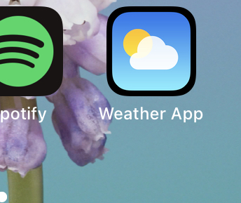

##### 

## Weather Progressive Web Application

## 💻 📱 Check out live 📱💻

dont forget to insall it to check by Add it to home screen



- https://frosty-dubinsky-57ae10.netlify.app/

## Usage of API ✔️

| API         | Description                             |
| ----------- | --------------------------------------- |
| OpenWeather | use the endpoint api.openweathermap.org |

## 📱 How works 📱:-

> - search by city
> - input will call the api
> - register-service-worker to cache data
> - works offline , and you can insall it to your phone as app

### Requirements ✔️

_mandatory requirements_ that make up the App are

- HTML
- CSS
- JAVASCRIPT
- API

## ⚡️ Installation ⚡️

```zsh
npx create-react-app ./
```

```zsh
yarn add axios
```

```zsh
Yarn add dotenv
```

## Usage

```javascript
import axios from "axios";
import dotenv from "dotenv";

dotenv.config();
```

## Contact 📲 :-

<a href="https://www.linkedin.com/in/ayman-omer-b2429b1ab"></a> <a href="https://github.com/aymanjebril2"></a>
